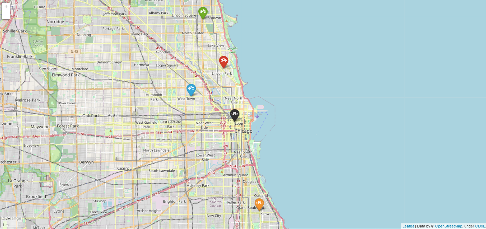

# Chicago-sharebikes-data-analyse

原始数据集太大，请前往kaggle下载[chicago-divvy-bicycle-sharing-data](https://www.kaggle.com/datasets/yingwurenjian/chicago-divvy-bicycle-sharing-data)，文件夹中含有的csv文件是经过一定处理的数据集，文件夹中的ipynb是进行分析是用的jupyter note 文件，时间久远，代码没有怎么整理，可能有点乱，5_area.html是使用folium把数据K-Means聚类分析后得到的五个区域中心的地图表示文件，将鼠标靠近那五个图标后会显示进一步的信息

